# ADR-0002: Licensed Medicine Sources & Knowledge Ingestion

**Status:** Accepted  
**Decision Date:** 2026-09-29  
**Owner:** Content Review Council, DPO

## Context

The platform must serve three modalities with distinct pharmacopeias and evidence standards:
- **Allopathy:** Evidence-based guideline sources (ECOG, WHO, IMA)
- **Ayurveda:** Authoritative texts (Charaka Samhita, Susruta Samhita, modern monographs)
- **Homeopathy:** Authoritative repertories and materia medicas (Boericke, Kent, etc.)

We cannot:
- Scrape Wikipedia or unreviewed websites for medicine facts
- Train LLMs on production medicine data
- Use generative AI to author medicine monographs
- Blend unvetted sources into the clinical knowledge base

## Decision

### 1. Approved Source Categories

| Modality | Source Type | Examples | Approval Process |
|----------|-------------|----------|------------------|
| **Allopathy** | Official guidelines | ECOG (AIIMS), WHO, IMA, National formulary | Content Review Council + Medical Director |
| **Allopathy** | Regulatory database | DCC (Drugs Controller General), BNF (UK) equivalents | License verification + annual review |
| **Ayurveda** | Classical texts | Charaka Samhita, Susruta Samhita, Bhava Prakash | CCM-recommended editions only |
| **Ayurveda** | Modern monographs | Indian Herbal Pharmacopeia, IAMR vetted sources | Published by CCIM or Ministry of AYUSH |
| **Homeopathy** | Authoritative repertories | Kent's Repertory, Boericke's Materia Medica | CHB-recommended + CCH validated |
| **Homeopathy** | Provings | Clark's Dictionary, Farrington's Materia Medica | Published by CCH or WHO Homoeopathic Pharmacopoeia |

### 2. Medicine Monograph Schema

Every monograph is a versioned, authored, reviewed document:

```ts
interface MedicineMonograph {
  // Identity
  id: string;
  canonical_name: string;
  brand_names: string[];
  modality: 'allopathy' | 'ayurveda' | 'homeopathy';
  formulation: 'tablet' | 'liquid' | 'powder' | 'capsule' | 'cream' | 'injection';
  strength: string; // e.g., "500mg", "30C potency"
  route: 'oral' | 'topical' | 'injection' | 'inhalation';
  country: string; // e.g., 'IN'
  regulatory_status: 'approved' | 'under_review' | 'restricted' | 'deprecated';

  // Composition
  active_ingredients: {
    name: string;
    quantity_per_unit: string;
    source?: string; // e.g., "plant_extract", "mineral"
  }[];
  excipients: string[];
  manufacturer?: string;

  // Clinical content (patient-safe summary)
  patient_summary: string;
  how_commonly_used?: string; // Educational only, not prescriptive

  // Clinical content (clinician-only detail)
  indications: {
    indication: string;
    mechanism?: string;
    evidence_level: 'high' | 'moderate' | 'low' | 'traditional' | 'anecdotal';
    sources: SourceReference[];
  }[];

  // Safety (mandatory)
  contraindications: string[];
  warnings: string[];
  allergy_potential?: string;
  common_interactions: { medicine: string; severity: 'mild' | 'moderate' | 'severe' }[];
  adverse_effects: { effect: string; frequency: 'common' | 'uncommon' | 'rare' }[];
  pregnancy_lactation_caution?: string;
  renal_hepatic_caution?: string;
  age_restrictions?: string;
  overdose_emergency_info?: string;

  // Governance
  source_url: string;
  source_document_date: string; // ISO 8601
  reviewer_id: string;
  review_date: string;
  expiry_date: string; // Must be re-reviewed before this date
  approval_state: 'draft' | 'approved' | 'deprecated';
  change_history: ChangeEvent[];

  // Display controls
  patient_visible: boolean;
  modality_disclaimer: string; // e.g., "This is a homeopathic remedy..."
  evidence_label: string; // e.g., "Traditional use only"
  show_not_a_prescription_label: boolean;
  locales: string[]; // e.g., ['en_IN', 'hi_IN']
}

interface SourceReference {
  title: string;
  url?: string;
  published_date?: string;
  author?: string;
  confidence: 'primary' | 'secondary';
}

interface ChangeEvent {
  date: string;
  change_type: 'created' | 'updated' | 'deprecated' | 'reactivated';
  author_id: string;
  reason: string;
  diff?: object;
}
```

### 3. Ingestion & Review Workflow

```mermaid
graph LR
  Source["Licensed Source\n(PDF/HTML/DB)"]
  Ingest["OCR / Parse\nChunk by Section"]
  Review["Content Review\nModality Lead Review"]
  Approval["Approval\nContent Council + Medical Director"]
  Index["Index in\nVector DB\nwith Metadata"]
  Production["Production\nRetrieval\n(Versioned)"]
  Deprecate["Expiry / Recall\nAutomatic Exclusion"]

  Source -->|upload_document| Ingest
  Ingest -->|create_draft| Review
  Review -->|approve_monograph| Approval
  Approval -->|signed| Index
  Index -->|promote| Production
  Production -->|on_expiry| Deprecate
```



**Timing:**
- Ingestion: 1–2 weeks (OCR + parsing)
- Review: 2–4 weeks (modality lead + pharmacist)
- Approval: 1 week (board sign-off)
- Total to production: 4–7 weeks

### 4. Vector Index & Retrieval Controls

**What is indexed:**
- Monograph ID, canonical name, modality, formulation, strength, route, country
- Indications, mechanism, evidence level, sources
- Contraindications, warnings, interactions (for safety checks)
- Change date, expiry date, approval state, locales
- Chunk ID, section, position within document

**What is NOT indexed:**
- Patient identifiers
- Unreviewed or deprecated content
- Competitor pricing or product rankings
- Advertiser campaign fields

**Retrieval filters (applied on every query):**
```ts
const retrieve_approved_monographs = (
  query: string,
  tenant_id: string,
  modality: string,
  locale: string,
  age_group: 'adult' | 'pediatric',
  safety_context: { allergies: string[], active_meds: string[] }
) => {
  // Only return if:
  // - approval_state === 'approved'
  // - modality matches (no cross-contamination)
  // - !expired
  // - matches locale
  // - age_restrictions compatible
  // - not contraindicated (initial safety pass)
  // - retrieve timestamp + version ID for audit trail
}
```

### 5. Expiry & Freshness

- **Review date:** Monographs are reviewed on ingestion; mark next review due date
- **Expiry:** If >6 months since last review, automatically exclude from retrieval
- **Deprecation:** If source is recalled/retracted, mark deprecated with reason
- **Reactivation:** Only Content Review Council can re-approve deprecated monographs

---

## Implications

1. **Do not rely on public APIs or real-time web search for medicine facts.**
2. **All medicine information must be traceable to a licensed source.**
3. **Clinicians reviewing AI-drafted plans can always see and challenge the source.**
4. **Medicine content changes require board approval; no auto-updates.**
5. **Audit trail logs which version of monograph was used in each patient case.**

---

## Related ADRs
- ADR-0001: Jurisdiction & Governance
- ADR-0004: LangGraph CDS & Citation Verification
